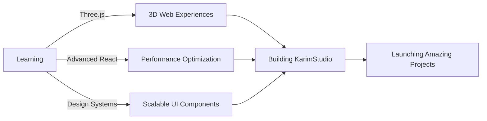

<div align="center">
  
# 👋 Hey, I'm Abdikarim Mohamed

### Software Engineer | UI/UX Enthusiast | Building Digital Experiences


</div>

---

## 🚀 About Me

```javascript
const karim = {
    location: "Thika, Kenya 🇰🇪",
    studio: "KarimStudio",
    role: "Software Engineer & Designer",
    code: ["JavaScript", "TypeScript", "Python", "HTML/CSS"],
    technologies: {
        frontend: ["React", "Next.js", "Tailwind CSS", "Vite"],
        backend: ["Node.js", "Express", "MongoDB", "PostgreSQL"],
        tools: ["Git", "Figma", "VS Code", "Postman"],
        currentlyLearning: ["Three.js", "WebGL", "Advanced React Patterns"]
    },
    architecture: ["SPA", "Responsive Design", "REST APIs", "Microservices"],
    currentFocus: "Building scalable web applications with modern tech",
    funFact: "I believe good design and clean code should work together ✨"
};
```

---

## 🛠️ Tech Stack

<div align="center">

### Frontend


### Backend & Database


### Tools & Platforms


</div>

---

## 📊 GitHub Stats

<div align="center">
  


</div>

---

## 🔥 GitHub Streak

<div align="center">
  


</div>

---

## 🏆 GitHub Trophies

<div align="center">
  


</div>

---

## 📈 Contribution Graph

<div align="center">
  


</div>

---

## 💼 Featured Projects

<div align="center">

[](https://github.com/karim-kodes/KarimStudio)
[](https://github.com/karim-kodes/Natours)


</div>

---

## 🎯 Current Focus

<div align="center">



</div>

---

## 📫 Let's Connect

<div align="center">

[](https://karimstudio.com)
[](https://linkedin.com/in/karim-kodes)
[](https://twitter.com/karim_kodes)
[](mailto:contact@karimstudio.com)

</div>

---

## 💡 Random Dev Quote

<div align="center">
  


</div>

---

## 🐍 Contribution Snake

<div align="center">
  
<picture>
  <source media="(prefers-color-scheme: dark)" srcset="https://raw.githubusercontent.com/karim-kodes/karim-kodes/output/github-contribution-grid-snake-dark.svg">
  <source media="(prefers-color-scheme: light)" srcset="https://raw.githubusercontent.com/karim-kodes/karim-kodes/output/github-contribution-grid-snake.svg">
  
</picture>

</div>

---

<div align="center">

### 💻 "Code is poetry written in logic"


**Thanks for stopping by! Let's build something amazing together 🚀**

</div>
